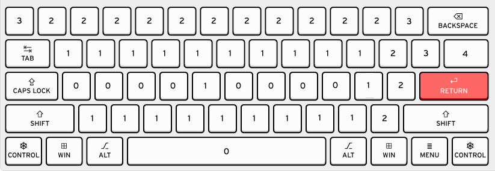

# Effort

<!-- def: effort -->

A shorthand should save the user time and energy. To evaluate Lesshand, we
assign every word or phrase a score called an *effort*. Effort is an estimate
of how hard the word or phrase is to write or type. Good abbreviations are ones
that save a lot of effort.

<!-- ref: r007-memorable -->
[R003: Effort](reqs.md#r003-effort) requires that all abbreviations in Lesshand
save at least 5 effort, except those for the 128 most common words, which must
save at least 1.

Space is always assigned an effort of 1.

### Keyboard

<!-- def: qwerty-effort -->

Keyboard effort is determined as follows:

- By default, keys have an effort of 2.
- Being a modified key adds 2 to the effort, i.e., symbols typed using shift,
  e.g., capitals, symbols like "!".
- Distance from the home row increases cost as shown in the following image:

Keyboard effort ranges from 2-7. Here are some example efforts:

<!-- def: qwerty-effort-examples -->

- f - 2
- [ - 3
- F - 4
- : - 5
- @ - 6
- ~ - 7

When keys are used twice in a row, the second use always has an effort of 2.
This reflects the fact that your finger has already traveled to the key and you
are already holding down shift (if necessary for that key).

All of this is relative to a ANSI US QWERTY keyboard.

### Printing

<!-- def: print-effort -->

Printed effort is determined as follows:

- By default, characters have an effort equal to two times the number of
  *strokes* it takes to print them, where a "stroke" is defined to be lifting
  the pen off the page.
- Then the number of *turns* is added to their effort, where a turn is a sharp
  corner when printing (e.g. "<" has one, but "/" has none).

Here are some example efforts:

<!-- def: print-effort-examples -->

- f - 4
- [ - 4
- F - 5
- : - 4
- @ - 3
- ~ - 2
- / - 2
- < - 3
- m - 4

<!--

### Cursive

All letters in cursive have an effort of 1 except those that often take two
strokes to create: "H", "K", "T", "X", "i", "j", "t". Punctuation and numbers
are shared with printing.

-->
